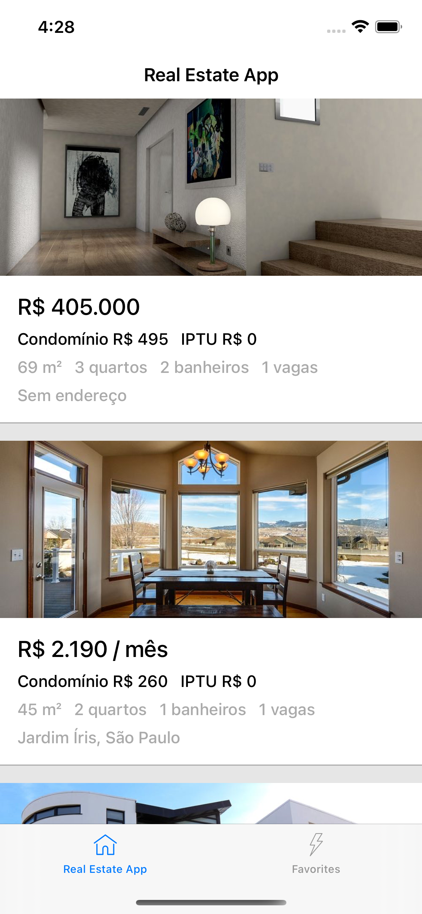
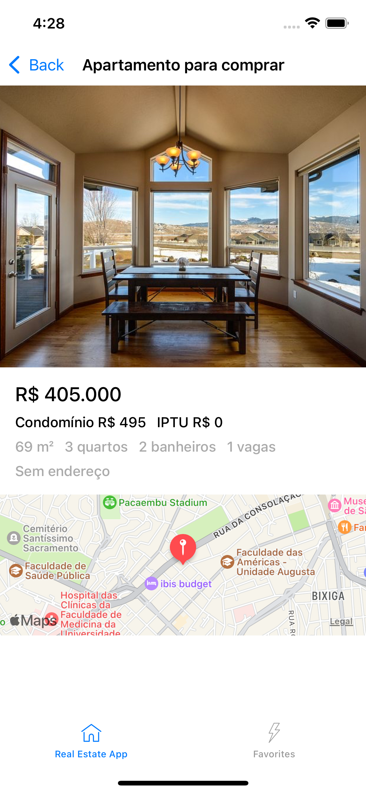

# ViewCode Challenge - Real Estate 

No Desafio ViewCode, temos apenas tarefas de implementação de interfaces via código (ViewCode). Nosso objetivo é implementar a interface de um app de anúncios imobiliários, seguindo todas as boas práticos de desenvolvimento ágil e Git.

Nesse desafio, você terá a oportunidade de trabalhar com UIScrollView, UIStackView, MKMapView, UICollectionView, e outros componentes utilizados no desenvolvimento iOS.

# Iniciando os trabalhos

1. Faça um fork deste repositório.
2. Clone o fork na sua máquina.
2. Abra a pasta `solutions` e acesse o projeto referente à sua Sprint.
3. Faça um build e rode o projeto. ▶️

# Sobre a Devpass

A Devpass é uma comunidade de pessoas desenvolvedoras de alto potencial acelerando suas carreiras através de desenvolvimento de produtos reais, como o Hereminders, e conexões com as principais lideranças de tecnologia do país, através de mentorias particulares e Tech Talks.

Se interessou? Acesse www.devpass.com.br e se inscreva na nossa lista para ficar por dentro das novidades!